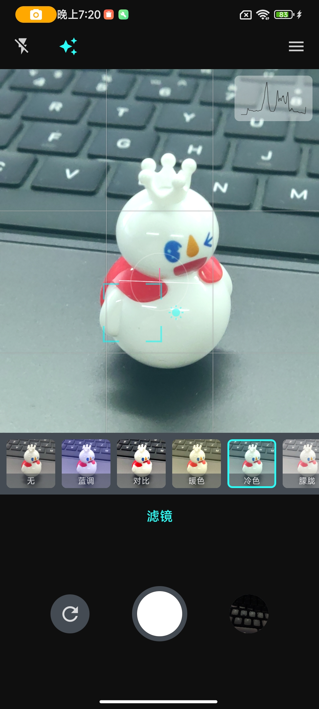
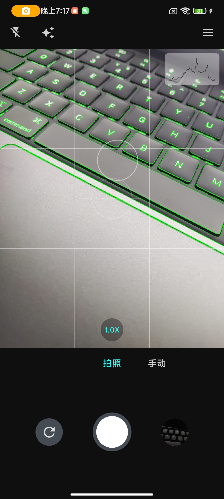
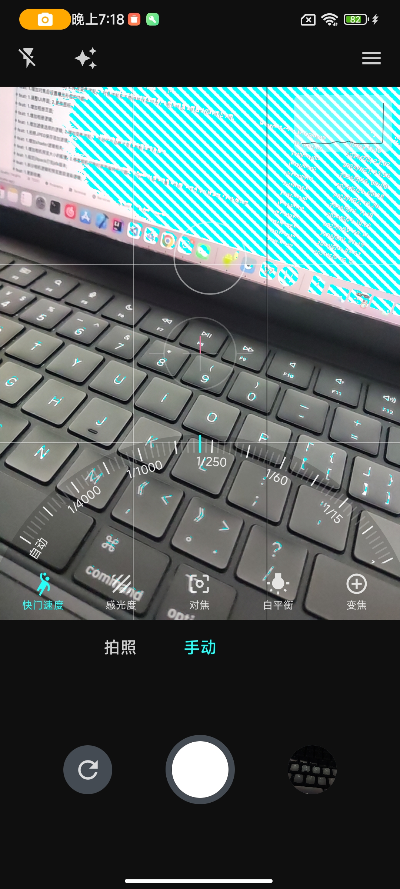
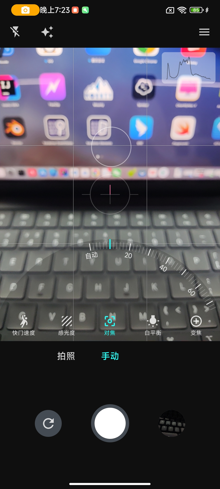

# RawCamera

📷 An universal professional camera.

一款基于`Camera2`开发的通用的专业相机

#### 📝 图片浏览组件 👉 [SCALE](https://github.com/jvziyaoyao/scale)

#### 👨‍💻 产品与开源 👉 [JVZIYAOYAO](https://www.jvziyaoyao.com)

 

👌 实现
--------
| Function           | Supported |
|:-------------------|:---------:|
| RAW                |     ✅     |
| HEIF               |     ✅     |
| Manual mode        |     ✅     |
| Flash light        |     ✅     |
| Photo Filter       |     ✅     |
| Focus Peaking      |     ✅     |
| Brightness Peaking |     ✅     |
| Histogram          |     ✅     |
| Image preview      |     ✅     |
| Spirit level       |     ✅     |
| HDR                |     ⛔     |
| Beauty             |     ⛔     |
| Recording          |     ⛔     |
| Ultra wide         |     ⛔     |
| High Pixel         |     ⛔️     |

🧐 预览
--------
<!-- |  |  |  |     |
|----------------------------------|----------------------------------|---------------------------------------|-----------------------------------|
| Photo Filter                     | Focus Peaking                    | Brightness Peaking                    | Manual mode                       | -->

|  |  |  |  |
|:-----:|:-----:|:-----:|:-----:|
| Photo Filter | Focus Peaking | Brightness Peaking  | Manual mode |

<!--  -->
<!--  -->

🕵️‍♀️ 开源许可
--------
Copyright 2024 jvziyaoyao

Licensed under the Apache License, Version 2.0 (the "License");
you may not use this file except in compliance with the License.
You may obtain a copy of the License at

       http://www.apache.org/licenses/LICENSE-2.0

Unless required by applicable law or agreed to in writing, software
distributed under the License is distributed on an "AS IS" BASIS,
WITHOUT WARRANTIES OR CONDITIONS OF ANY KIND, either express or implied.
See the License for the specific language governing permissions and
limitations under the License.
